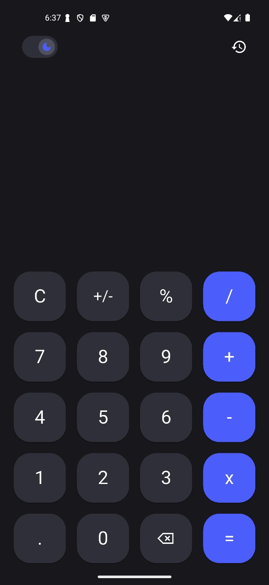

# 🧮 Flutter Calculator App

A beautiful and functional calculator app built with Flutter, featuring a clean interface, calculation history, and smooth user experience.


## 📱 Screenshots

<div align="center">
  
</div>

## ✨ Features

- 🔢 **Basic Operations** - Addition, subtraction, multiplication, and division
- 📊 **Calculation History** - Keep track of all your calculations
- 🎨 **Modern UI** - Clean and intuitive material design interface
- ⚡ **Real-time Calculations** - Instant results as you type
- 🌙 **Beautiful Theme** - Carefully crafted color scheme and typography
- 📱 **Responsive Design** - Works perfectly on all screen sizes
- 🧠 **Smart Controller** - Efficient state management with dedicated math controller
- 🔄 **Clear & Delete** - Easy to clear entries or delete last digit

## 🚀 Getting Started

### Prerequisites

- Flutter SDK (>=3.0.0)
- Dart SDK (>=3.0.0)
- Android Studio / VS Code
- An Android or iOS device/emulator

### Installation

1. **Clone the repository**

   ```bash
   git clone https://github.com/yourusername/flutter-calculator.git
   cd flutter-calculator
   ```

2. **Install dependencies**

   ```bash
   flutter pub get
   ```

3. **Run the app**
   ```bash
   flutter run
   ```

## 📂 Project Structure

```
lib/
├── main.dart                        # App entry point
│
├── screens/                         # UI Screens
│   ├── app.dart                    # Main app configuration
│   ├── calc_screen.dart            # Calculator main screen
│   ├── custom_app_bar.dart         # Custom app bar widget
│   └── history_screen.dart         # Calculation history screen
│
├── controller/                      # Business Logic
│   └── math_controller.dart        # Math operations controller
│
└── theme/                           # Theme Configuration
    └── app_theme.dart              # App theme and styling

assets/
└── screenshots/                     # App screenshots
    └── calc.jpg
```

## 🏗️ Architecture

This project follows a **simple and efficient architecture**:

### Screens Layer

- **app.dart**: Main application setup with routing and theme
- **calc_screen.dart**: Primary calculator interface with buttons and display
- **custom_app_bar.dart**: Reusable custom app bar component
- **history_screen.dart**: Display past calculations

### Controller Layer

- **math_controller.dart**: Handles all mathematical operations and state management
  - Input validation
  - Calculation logic
  - History management
  - State updates

### Theme Layer

- **app_theme.dart**: Centralized theme configuration
  - Color schemes
  - Text styles
  - Button styles
  - Consistent design system

## 🎯 Key Features Breakdown

### Calculator Screen

- **Numeric Input**: Digits 0-9 with responsive buttons
- **Operations**: +, -, ×, ÷ operators
- **Special Functions**:
  - Clear (C) - Reset calculator
  - Delete (⌫) - Remove last digit
  - Equals (=) - Compute result
  - Decimal (.) - For decimal numbers
- **Display**: Large, readable result display

### History Screen

- View all previous calculations
- Timestamp for each calculation
- Scroll through calculation history
- Clear history option

### Math Controller

- State management using Flutter's built-in solutions
- Handles complex calculation logic
- Maintains calculation history
- Validates user input
- Prevents calculation errors

## 🛠️ Built With

- **[Flutter](https://flutter.dev/)** - UI framework
- **[Dart](https://dart.dev/)** - Programming language
- **Material Design** - Design system

## 📝 Code Highlights

### Calculator Button Example

```dart
ElevatedButton(
  onPressed: () => controller.addDigit('7'),
  style: ElevatedButton.styleFrom(
    shape: CircleBorder(),
    padding: EdgeInsets.all(20),
  ),
  child: Text('7', style: TextStyle(fontSize: 24)),
)
```

### Math Operation Logic

```dart
class MathController {
  String equation = "";
  String result = "";
  List<String> results = [];

  void addNumber(String num) {
    if (num == '.' && equation.endsWith('.')) {
      equation = equation.substring(0, equation.length - 1);
      return;
    }
    equation += num;
  }

  //! Handle Basic Logic
  void addOperator(String op) {
    if (equation.isEmpty) {
      if (op == '-') {
        equation += op;
      }
      return;
    }

    void evaluate() {
    if (equation.isEmpty) return;

    String expStr = equation.replaceAll('x', '*').replaceAll('%', '/100');

    try {
      ShuntingYardParser parser = ShuntingYardParser();
      Expression exp = parser.parse(expStr);

      var evaluator = RealEvaluator(ContextModel());
      num eval = evaluator.evaluate(exp);

      result = eval.toString(); // النتيجة
      results.add('$equation = $result');
    } catch (e) {
      result = "please enter a valid equation";
    }
  }
    }
}
```

## 🌟 Features Implemented

- ✅ Basic arithmetic operations (+, -, ×, ÷)
- ✅ Decimal number support
- ✅ Clear and delete functionality
- ✅ Calculation history
- ✅ Custom app bar
- ✅ Responsive button layout
- ✅ Error handling
- ✅ Clean architecture
- ✅ Material Design UI
- ✅ State management

## 🔮 Future Enhancements

- [ ] Scientific calculator mode
- [ ] Advanced operations (√, x², %, etc.)
- [ ] Memory functions (M+, M-, MR, MC)
- [ ] Dark mode support
- [ ] Landscape mode with extended features
- [ ] Calculation export (share/save)
- [ ] Custom themes
- [ ] Haptic feedback
- [ ] Sound effects
- [ ] Unit converter
- [ ] Currency converter
- [ ] History search and filter
- [ ] Graph plotting

## 🎨 Design Philosophy

- **Minimalist**: Clean interface without clutter
- **Intuitive**: Familiar calculator layout everyone knows
- **Responsive**: Smooth animations and transitions
- **Accessible**: Large buttons and high contrast
- **Consistent**: Following Material Design guidelines

## 🧪 Testing

Run the tests with:

```bash
flutter test
```

## 📱 Supported Platforms

- ✅ Android
- ✅ iOS
- ✅ Web (with responsive design)
- ✅ Desktop (Windows, macOS, Linux)

## 🤝 Contributing

Contributions are what make the open-source community such an amazing place to learn, inspire, and create. Any contributions you make are **greatly appreciated**.

1. Fork the Project
2. Create your Feature Branch (`git checkout -b feature/ScientificMode`)
3. Commit your Changes (`git commit -m 'Add scientific calculator mode'`)
4. Push to the Branch (`git push origin feature/ScientificMode`)
5. Open a Pull Request

## 📄 License

This project is licensed under the MIT License - see the [LICENSE](LICENSE) file for details.

## 👨‍💻 Author

**Your Name**

- GitHub: [@ahmedalaayq](https://github.com/ahmedalaayq)
- Email: ahmed.alaayq@gmail.com

## 🙏 Acknowledgments

- Flutter team for the amazing framework
- Material Design for design guidelines
- The Flutter community for inspiration and support

## 📞 Support

If you like this project, please ⭐ star this repository!

Found a bug or have a feature request? [Open an issue](https://github.com/ahmedalaayq/calculator/issues)
---

<div align="center">
  
  **Made with Ahmed Emad ❤️ and Flutter**
  
  If this project helped you, consider buying me a coffee! ☕
  
</div>
